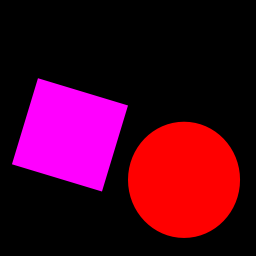
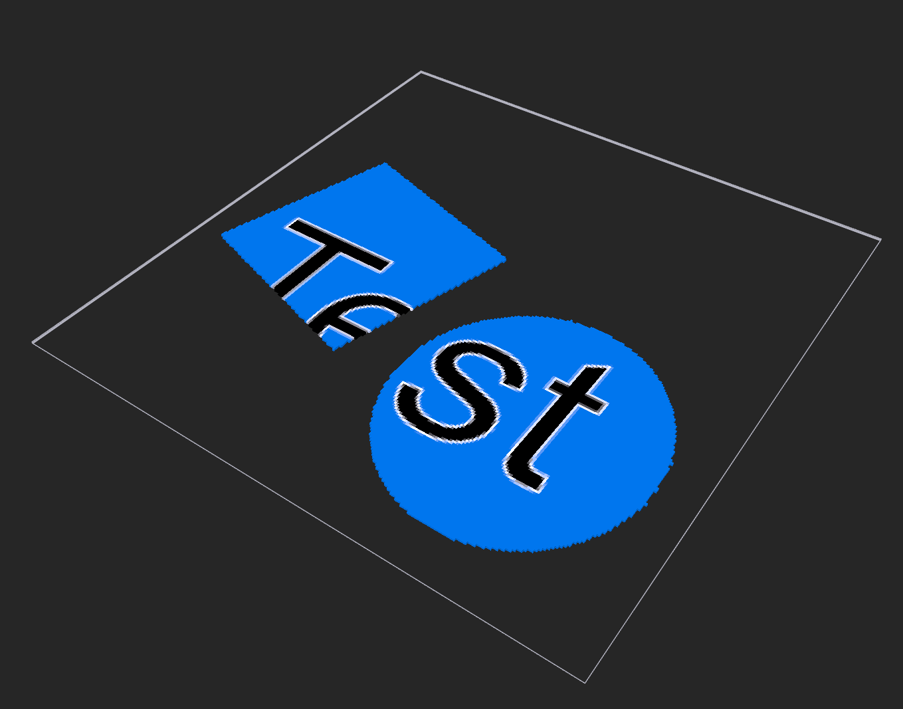

# Texture to vox
Generates a magicavoxel file from a texture. This is built specifically for Teardown so it will only allow their to be up to 16 colors for each material.

It uses 2 different images to generate the vox file.
- **Material**: Which material to use
- **Color**: The texture that is overlayed on top of the voxels 

## Example

### **Material**

### **Color**

### **Final output**
